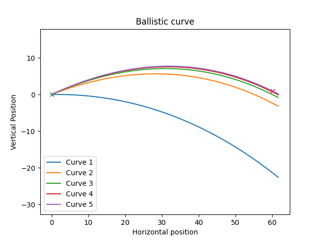

# ShootingSimulator

## Simulation

### Build

This project requires catch2 framework to be installed on the system.
To build the project you need cmake and to run these commands:

`cmake .`

`cmake --build .`

To build the project I needed to use g++-11. I set the required compiler as follows:

`export CXX=g++-11`

### Run

To run the simulation simply run:

`../ShootingSimulator input.json output.json`

where input.json contains params of simulations.

## Visualization

To better check the results of simulation a simple visualization tool was created using python and matplotlib.

### Install

`pip install -r requirements.txt`

or

`pip install matplotlib`

### Run

`python3 visualize.py output.json`

## Aim with math

equation for horizontal direction:

$$s_h = v_h t$$

$$ t = {s_h \over v_h} $$

vertical direction:

$$s_v = {1 \over 2} Gt^2 +v_tt$$

equation how two velocities relate:

$$v^2 = v_h^2 +v_v^2$$

$$ v_v = \sqrt{v^2-v_h^2} $$

Series of derivations that combines equations:

$$ s_v = {1 \over 2} Gt^2 +t{\sqrt{v^2-v_h^2}}$$

$$ s_v = {1 \over 2} G{s_h^2 \over v_h^2} +{s_h \over v_h}{\sqrt{v^2-v_h^2}} $$

$$  s_v v_h^2 = {1 \over 2} G{s_h^2 } +{s_h v_h}{\sqrt{v^2-v_h^2}} $$

$$ {s_v v_h^2 - {1 \over 2} G{s_h^2 } \over {s_h v_h}}  =  {\sqrt{v^2-v_h^2}} $$

$$ {s_v^2 v_h^4 -s_v v_h^2Gs_h^2 + {1 \over 4} G^2{s_h^4 } \over {s_h^2 v_h^2}}  =  v^2-v_h^2 $$

$$ s_v^2 v_h^4 -s_v v_h^2Gs_h^2 + {1 \over 4} G^2 s_h^4  =  v^2s_h^2 v_h^2-v_h^2s_h^2 v_h^2 $$

That leads to quadratic equation:

$$ (s_v^2+s_h^2)(v_h^2)^2 + (-s_hGs_h^2 - v^2s_h^2)v_h^2 + {1 \over 4} G^2 s_h^4 = 0 $$

$$ a = s_v^2+s_h^2$$

$$ b = -s_hGs_h^2 - v^2s_h^2$$

$$ c = {1 \over 4} G^2 s_h^4$$

That can be solved using quadratic formula:

$$ v^2 = {-b \pm \sqrt{b^2-4ac} \over 2a} $$

This gives precise solution asuming there is no drag. And can also be used to estimate the solution with drag. The solution can be further refined iteratively changing position we aim for. If the bullet is 1 m to high we pretend the target is 1m higher and run the simulation again. And again and again. Until sufficient precision is achieved.
